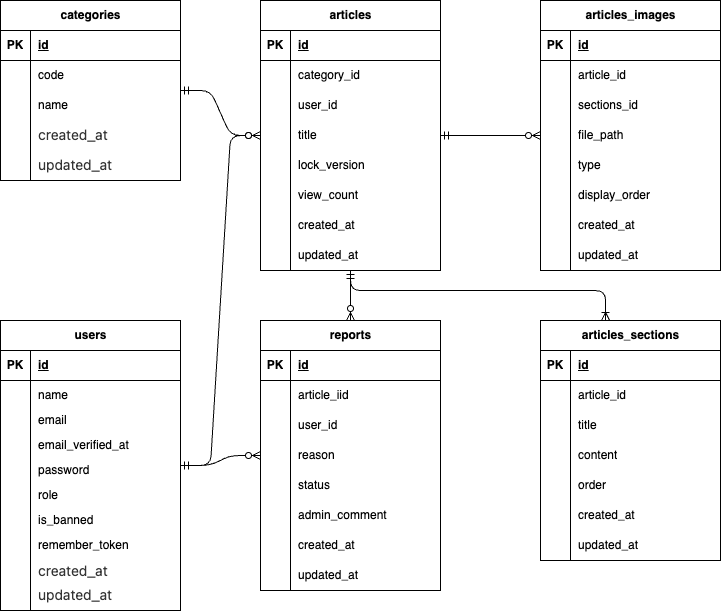

# 百科事典アプリ「もんじゅ」

## 概要

個人開発です。誰でも自由に記事を作成し、みんなで編纂する、日本十進分類法に基づいた現代的な百科事典プラットフォームです。

##　プレビュー

①　ログイン->トップ画面->記事詳細画面

<video src="https://github.com/user-attachments/assets/941d7f25-c3e2-48f4-a515-494f8ba4b59b
" loop muted autoplay playsinline width="100%"></video>

②　記事詳細画面->編集画面->編集登録

<video src="https://github.com/user-attachments/assets/0290dc74-0c3b-425c-a84e-18282f4004de
" loop muted autoplay playsinline width="100%"></video>

**特徴**

- カテゴリ: 図書館で利用される日本十進分類法（NDC）を参考に、0〜9類の分類に基づいて記事を分類しています。
- 編集: 1つの記事に対して最大10個の見出しと本文を自由に構成できます。
- 画像管理: セクションごとに画像を紐付け、視覚的に分かりやすい記事を作成できます。記事全体で最大5枚アップロードできます。
- 楽観的ロック: 複数人による同時編集時のデータ上書きを防止します。
- 運営機能: 通報システムと管理者によるユーザー凍結機能を備えています。

## 前提条件

本環境を構築するには、以下のツールが必要です。

- Git: 2.x 以上  
  確認方法: `git --version`

- Docker: 20.x 以上  
  確認方法: `docker --version`

- Node.js: 20.x 以上 (フロントエンドビルド用)
  確認方法: `node -v`

## 使用技術(実行環境)

**バックエンド**

- PHP: 8.2+
- Laravel: 11.x
- Laravel Sail: (Docker 実行環境)
- Laravel Sanctum: (SPA 認証)
- MySQL: 8.0

**フロントエンド**

- Next.js: 14/15 (App Router)
- TypeScript: 5.x
- Tailwind CSS: v4.0
- Axios: API 通信

## 環境構築

1.  リポジトリのクローン

    ```bash
    git clone <repository_url>
    cd encyclopedia-app
    ```

2.  バックエンド (Laravel Sail) のセットアップ

    ```bash
    cd laravel-backend

    //依存パッケージのインストール
    docker run --rm \
    -u "$(id -u):$(id -g)" \
    -v "$(pwd):/var/www/html" \
    -w /var/www/html \
    laravelsail/php83-composer:latest \
    composer install --ignore-platform-reqs

    //.envの作成
    cp .env.example .env

    //Sailの起動
    ./vendor/bin/sail up -d

    //キー生成とマイグレーション、初期データ投入
    ./vendor/bin/sail artisan key:generate
    ./vendor/bin/sail artisan migrate:fresh --seed
    ./vendor/bin/sail artisan storage:link
    ```

3.  フロントエンド (Next.js) のセットアップ

    ```bash
    cd ../nextjs-frontend

    //.env.localの作成
    cho "NEXT_PUBLIC_BACKEND_URL=http://localhost" > .env.local

    //パッケージインストールと起動
    npm install
    npm run dev
    ```

## テストユーザー（開発環境専用）

`seed` を実行すると、初期データが投入されます。
※ 本番環境では使用しないでください。

| 権限             | メールアドレス      | パスワード |
| :--------------- | :------------------ | :--------- |
| **管理者**       | `admin@example.com` | `abab1234` |
| **一般ユーザー** | `user@example.com`  | `1234abab` |

## テスト実行方法

```bash
cd laravel-backend
./vendor/bin/sail artisan test
```

## URL

- サイトTOP: http://localhost:3000
- phpMyAdmin: http://localhost:8080

## テーブル仕様

### users テーブル

ユーザー情報を管理します。

| カラム名          | 型           | 制約              | 説明                                |
| :---------------- | :----------- | :---------------- | :---------------------------------- |
| id                | bigint       | Primary Key       | ユーザーID                          |
| name              | varchar(255) | Not Null          | ニックネーム                        |
| email             | varchar(255) | Unique, Not Null  | メールアドレス                      |
| email_verified_at | timestamp    | Nullable          | メール確認日時                      |
| password          | varchar(255) | Not Null          | パスワード                          |
| role              | varchar(255) | Default: 'member' | 権限（member: 一般, admin: 管理者） |
| is_banned         | boolean      | Default: false    | 凍結フラグ（trueでログイン不可）    |
| remember_token    | varchar(100) | Nullable          | ログイン保持トークン                |
| created_at        | timestamp    | Nullable          | 作成日時                            |
| updated_at        | timestamp    | Nullable          | 更新日時                            |

### categories テーブル

日本十進分類法に基づいたカテゴリマスターを管理します。

| カラム名   | 型           | 制約             | 説明                     |
| :--------- | :----------- | :--------------- | :----------------------- |
| id         | bigint       | Primary Key      | カテゴリID               |
| code       | varchar(255) | Unique, Not Null | 分類コード（0〜9）       |
| name       | varchar(255) | Not Null         | 分類名（総記、文学など） |
| created_at | timestamp    | Nullable         | 作成日時                 |
| updated_at | timestamp    | Nullable         | 更新日時                 |

### articles テーブル

記事の基本情報（メタデータ）を管理します。

| カラム名     | 型           | 制約             | 説明                          |
| :----------- | :----------- | :--------------- | :---------------------------- |
| id           | bigint       | Primary Key      | 記事ID                        |
| category_id  | bigint       | Foreign Key      | categories.id（所属カテゴリ） |
| user_id      | bigint       | Foreign Key      | users.id（最初の作成者）      |
| title        | varchar(255) | Unique, Not Null | 記事タイトル                  |
| lock_version | integer      | Default: 1       | 楽観的ロック用バージョン番号  |
| view_count   | integer      | Default: 0       | 総閲覧数                      |
| created_at   | timestamp    | Nullable         | 作成日時                      |
| updated_at   | timestamp    | Nullable         | 更新日時                      |

### article_sections テーブル

記事を構成する見出しと本文を管理します（1記事につき最大10件）。

| カラム名   | 型           | 制約        | 説明                    |
| :--------- | :----------- | :---------- | :---------------------- |
| id         | bigint       | Primary Key | セクションID            |
| article_id | bigint       | Foreign Key | articles.id（親記事ID） |
| title      | varchar(255) | Not Null    | 見出しタイトル          |
| content    | text         | Not Null    | 本文（Markdown形式）    |
| order      | integer      | Default: 0  | 表示順序                |
| created_at | timestamp    | Nullable    | 作成日時                |
| updated_at | timestamp    | Nullable    | 更新日時                |

### article_images テーブル

記事に関連する画像ファイルを管理します。

| カラム名      | 型           | 制約        | 説明                                            |
| :------------ | :----------- | :---------- | :---------------------------------------------- |
| id            | bigint       | Primary Key | 画像ID                                          |
| article_id    | bigint       | Foreign Key | articles.id（親記事ID）                         |
| section_id    | bigint       | Foreign Key | article_sections.id（紐付く見出し）※            |
| file_path     | varchar(255) | Not Null    | 画像ファイルの保存パス                          |
| type          | varchar(255) | Not Null    | 種類（thumbnail: サムネイル / content: 本文内） |
| display_order | integer      | Nullable    | セクション内での表示順                          |
| created_at    | timestamp    | Nullable    | 作成日時                                        |
| updated_at    | timestamp    | Nullable    | 更新日時                                        |

※サムネイルの場合は null となります。

### reports テーブル

記事に対する通報情報を管理します。

| カラム名      | 型           | 制約            | 説明                                        |
| :------------ | :----------- | :-------------- | :------------------------------------------ |
| id            | bigint       | Primary Key     | 通報ID                                      |
| article_id    | bigint       | Foreign Key     | articles.id（対象記事ID）                   |
| user_id       | bigint       | Foreign Key     | users.id（通報者ID）※                       |
| reason        | text         | Not Null        | 通報理由                                    |
| status        | varchar(255) | Default: 'open' | 対応状態（open: 未対応 / resolved: 解決済） |
| admin_comment | text         | Nullable        | 運営による対応メモ                          |
| created_at    | timestamp    | Nullable        | 通報日時                                    |
| updated_at    | timestamp    | Nullable        | 更新日時                                    |

※非会員による通報の場合は null となります。

## ER 図


